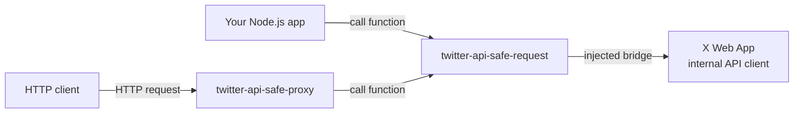

# twitter-api-safe-proxy

A TypeScript monorepo for calling the internal Twitter/X Web App API client from a logged-in browser opened with Playwright.

This is not just another Node.js HTTP client. It opens X.com in a real browser, hooks into the Web App's webpack runtime, captures the internal API client used by the page, and dispatches requests from Node.js through `page.evaluate()`.

In other words, this project delegates requests to the logged-in browser context instead of reimplementing cookies, auth state, CSRF handling, Web App request behavior, feature flags, and other moving parts in Node.js.

## What makes it different?

This project finds the API client that the X/Twitter Web App uses inside the browser, hooks into it, and lets that client perform requests on your behalf.



The important part is that Node.js does not directly reimplement X's internal API behavior. Instead, requests are routed through the client extracted from the live X Web App, so they run in the same browser environment as the Web App itself.

## Setup

### Docker (planned)

TODO

### Local

```sh
pnpm install
```

Install Playwright browsers if needed.

```sh
pnpm exec playwright install
```

## Configuration

Configure the proxy server port, log level, and browser profiles in the workspace-level `settings.json`.

```json
{
	"port": 3000,
	"logLevel": "info",
	"profiles": [
		{
			"name": "account1",
			"browser": {
				"userDataDir": "./../../user_data/account1",
				"headless": false,
				"viewport": { "width": 720, "height": 720 }
			}
		}
	]
}
```

`userDataDir` is the storage path for a Playwright persistent browser profile. On first launch, sign in to X/Twitter in the browser and keep the session saved before using the proxy.

## `twitter-api-safe-request` example

`twitter-api-safe-request` is published on npm:

https://www.npmjs.com/package/twitter-api-safe-request

```sh
pnpm add twitter-api-safe-request playwright
```

```ts
import { chromium } from "playwright";
import { injectTwitterClient } from "twitter-api-safe-request";

const context = await chromium.launchPersistentContext("./user_data/account1", {
	headless: false,
});

const page = await context.newPage();
const client = await injectTwitterClient(page);

await page.goto("https://x.com/home");
await client.waitStartup();

const result = await client.dispatch({
	method: "GET",
	path: "/2/users/me",
	params: {},
});
```
